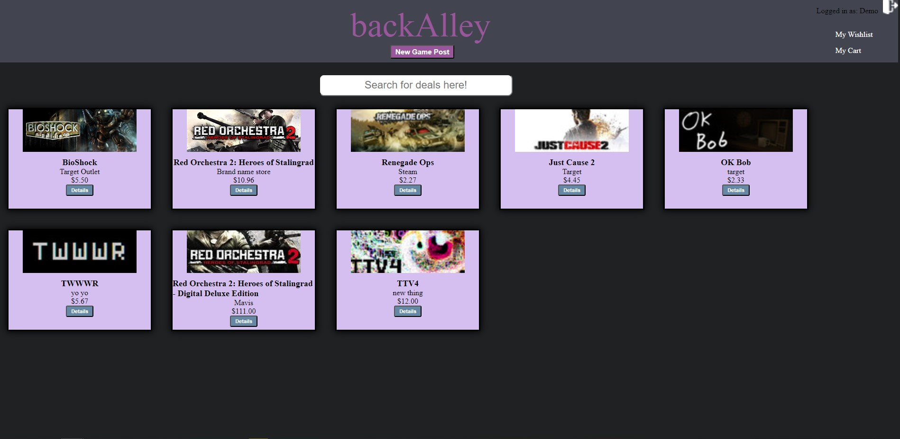
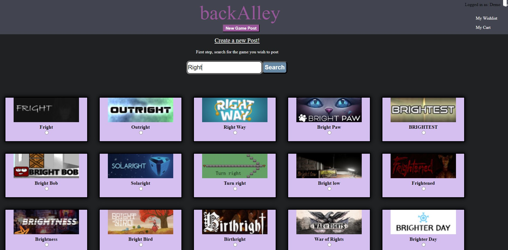
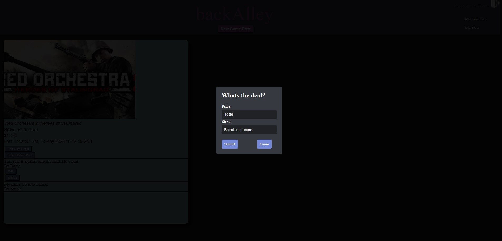
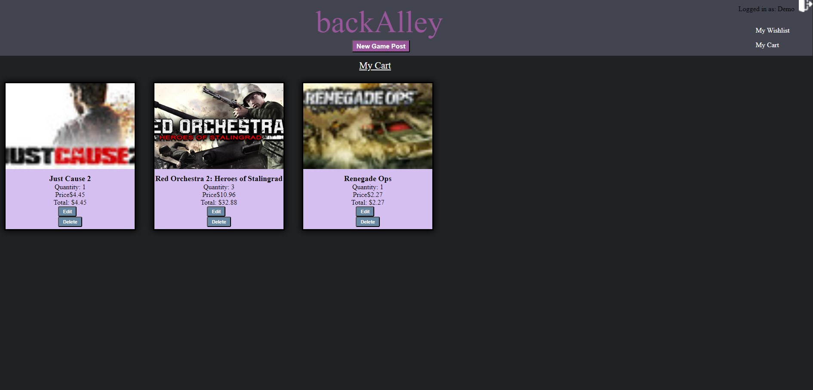

<h1 align=center>Back Alley </h1>

Back Alley is an app designed to get people the best deal possible for the games they want the most.  Pulling data from CheapShark's API, we allow users to make posts on games to notify others of any sort of sale going on.  These games can then be added to a shopping cart and purchased, or added to a wishlist to more easily keep tabs on them.

<h1 align=center>CRUD Features</h1>

This app includes full CRUD (Create, Read, Update, Delete) features for both the postings of the games as well as the reviews of those games. There are partial curds for a shopping cart and wishlist, though these will eventually be turned into full CRUDs. Additionally, users will be able to use a search bar to seek out the games they want, or can parse through a large list if that is their choosing.

<h3>Games</h3>
<ul align=left>
   <li>Create Game Posts by hitting the button at the top of any page and searching through a list of titles from an external API.  Once selected, you can input the price and the storefront where other users can find that deal.</li>
   <li>Read Game Posts on our home page.  You can filter through by using the search bar at the top of the page to find tthe game you're searching for.</li>
   <li>Update Game Posts on the details page of the post.  You can fix up any incorrect info, or update with a new deal.  This can also be done through our create system, which will update a selected game already in our system.</li>
   <li>Delete Game Posts on the details page of the post.  One click and the post will be wiped from our system.  It can always be added back in through our create system though!</li>
</ul>

<h3>Reviews</h3>
<ul align=left>
   <li>Create Reviews on the details page of a game post.  Each user can post only one review for a post in order to avoid fanboys or disgruntled users from spamming reviews.</li>
   <li>Read Reviews on the details page of a a game post, they are all on display just below the information of the post.  Each review is labeled so you can tell which users feel certain ways about the game. </li>
   <li>Update Reviews on your review itself.  You can only edit reviews that you've posted, not those that belong to other users.</li>
   <li>Delete Reviews on your review itself.  One click button to remove your review, allowing you to post another review.</li>
</ul>

<h3>Shopping Cart</h3>
<ul align=left>
   <li>Create Shopping Cart items on the details page of a game post.  Simply click the button and you will be taken to your shopping cart with your newly added game.</li>
   <li>Read Shopping Cart items on the shopping cart page in the top right corner.  You'll be able to see just how much you'll be spending on your games.  Made easy to read if you're planning on buying multiple copies for friends or family.</li>
   <li>Update Shopping Cart items on the shopping cart page.  Change just how many copies you are planning on getting, your total will be adjusted automatically.</li>
   <li>Delete Shopping Cart items on the shopping cart page.  Removing the item from your cart will adjust your total and you can always add the game back in at a later date.</li>
</ul>

<h3>Wishlist</h3>
<ul align=left>
   <li>Create Wishlist items on the details page of a game post.  Simply click the button and you will be taken to your wishlist with your newly added game. </li>
   <li>Read Wishlist items on the wishlist page.  This will allow you to more easily track any sort of changes to games you are interested in but don't want to pay too much for.</li>
   <li>Delete Wishlist items on the wishlist page.  If you're no longer interested in that particular game, it's a simple click of a button to remove it from your wishlist.</li>
</ul>

<h1 align=left>To Get Started </h1>

Clone the repository and navigate to the project directory.  From there, run npm install to install all necessary dependencies within the react-app folder.

Create a .env file and add the following variables:

<ul align=-left>
   <li>SECRET_KEY=lkasjdf09ajsdkfljalsiorj12n3490re9485309irefvn,u90818734902139489230</li>
   <li>DATABASE_URL=sqlite:///dev.db</li>
   <li>SCHEMA=flask_schema</li>
</ul>

To build or reset the database and run seeders, run the following comands in the root folder IN ORDER. 

<ol align=-left>
   <li>pipenv shell</li>
   <li>flask db upgrade</li>
   <li>flask seed all</li>
</ol>

Once you've run those three commands, start up the back end server in ther root directory by running flask run (make sure you're in your pipenv shell) head to the react-app folder and run npm start.
The application should now be running on the port specified in your .env file.
Please note that the above instructions assume that you have the necessary dependencies installed on your machine. If you are missing any dependencies, please refer to their respective documentation to learn how to install them. 

<h2 align=center>Technologies</h2>

  
  
  
  
  
  
  
  

Screencaps below of various features of the app

---Home page---

---Search area utilizing an API---

---One of our modals---

---
Shopping Cart page
---

